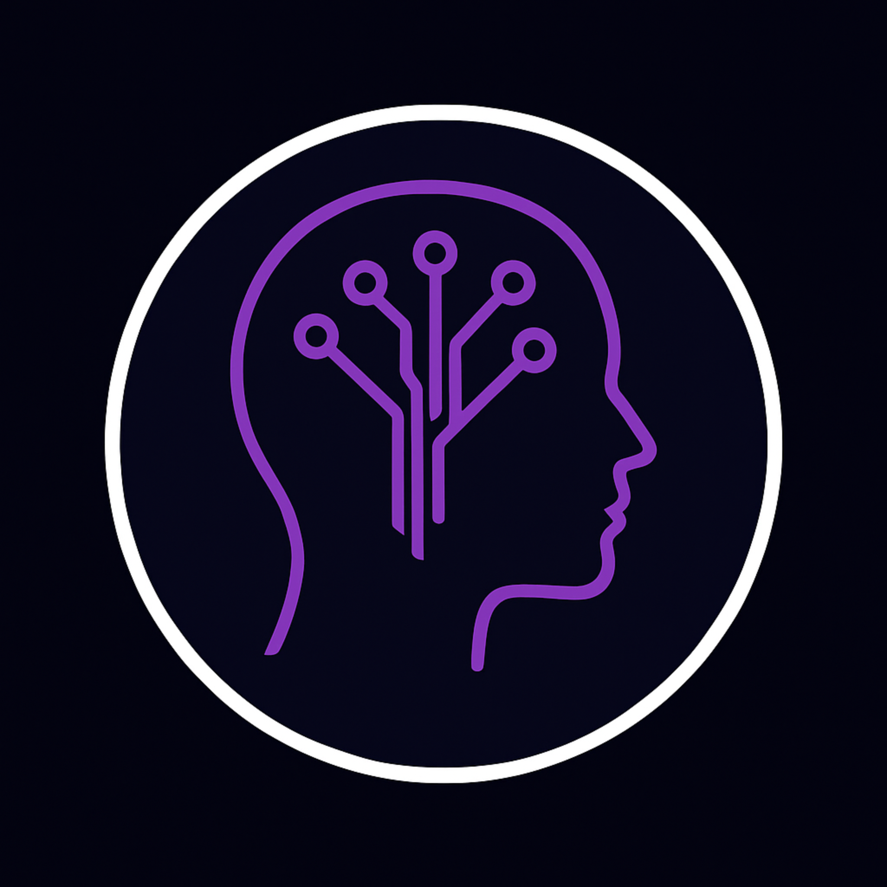

<h1>Custom Mind</h1>
<h3>Engineering scalable digital infrastructure for modern businesses</h3>

<a href="https://custommind.com.br">custommind.com.br</a> • Brazil • SaaS • Automation • Multi‑Tenant Systems

---

## Vision

Custom Mind builds scalable SaaS platforms and automation systems designed to transform operations into structured digital ecosystems.

We do not create websites.  
We engineer operational engines.

---

## Platform Preview

 
Loja Inteligente – Multi‑tenant management platform

---

## Core Products

### Loja Inteligente
Complete business management system.

- Multi‑tenant architecture  
- Dynamic theme engine  
- Modular activation  
- Real‑time configurator preview  
- Checkout integration  
- Scalable structure  

### Zuri
Instagram organic growth automation.

### Violet
AI‑driven DM engagement automation.

---

## Technical Architecture

Frontend:
- HTML5
- CSS3 (custom design system)
- Modular JavaScript
- Multi‑tenant ready structure

Deployment:
- GitHub Pages
- Custom domain (Registro.br)
- Automatic HTTPS (SSL)
- SEO structured implementation

---

## SEO Infrastructure

- Sitemap.xml
- Robots.txt
- Canonical URLs
- Structured Data (Schema.org)
- OpenGraph metadata
- Google Search Console configured
- Clean URL strategy

---

## Public Roadmap

### Phase 1 – Foundation (Completed)
- Institutional website
- Multi‑tenant configurator
- Checkout integration
- SEO infrastructure
- Custom domain + HTTPS

### Phase 2 – Expansion (In Progress)
- Blog section for authority building
- Case studies
- Performance optimization
- Advanced analytics integration

### Phase 3 – Scale
- SaaS dashboard deployment
- Client authentication layer
- API infrastructure
- Modular subscription model

---

## Market Positioning

Target:
- Local businesses
- Emerging digital operations
- Entrepreneurs scaling infrastructure

Differential:
- Automation‑first engineering
- Modular SaaS architecture
- Premium UI/UX
- Growth‑oriented mindset

---

## Founder

Built and engineered by  
Mateus Lemos Figueiredo  
Software Developer & Systems Architect

---

## Contact

Website: https://custommind.com.br  
WhatsApp: +55 11 92373-4039  
Email: contato@custommind.com.br  

---

Software engineered for growth.

