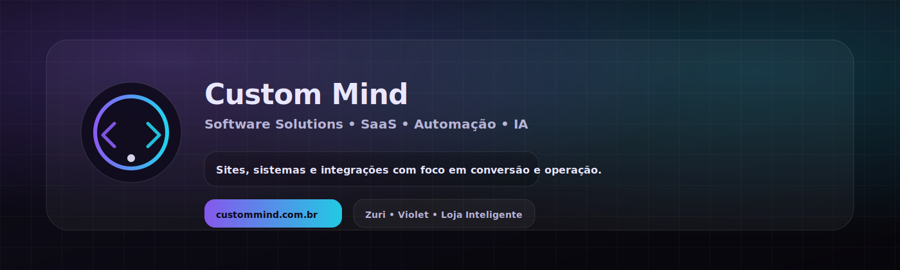

<!-- Custom Mind — README Premium -->
<p align="center">
  
</p>

<p align="center">
  <a href="https://custommind.com.br"><b>custommind.com.br</b></a> •
  <a href="https://instagram.com/custommind.solutions"><b>@custommind.solutions</b></a> •
  <a href="mailto:custommind.softwaresolutions@gmail.com"><b>custommind.softwaresolutions@gmail.com</b></a>
</p>

<p align="center">
  
</p>

---

## O que é este repositório

Site oficial da **Custom Mind | Software Solutions** — um hub simples, rápido e direto para apresentar:

- **Produtos**: Zuri, Violet e Loja Inteligente  
- **Serviços sob medida**: sistemas internos, automação e integrações  
- **Checkout (Pix)**: fluxo de pagamento com instruções e CTA para enviar comprovante

> Objetivo do site: **clareza + confiança + conversão**, com visual premium (dark-first) e performance real no mobile.

---

## Destaques (startup-style)

<table>
<tr>
<td width="50%">
   <b>Performance-first</b><br/>
  HTML/CSS/JS sem peso, carregamento rápido e UX limpa.
</td>
<td width="50%">
   <b>Confiabilidade</b><br/>
  Estrutura simples, previsível e fácil de manter.
</td>
</tr>
<tr>
<td width="50%">
   <b>Conversão</b><br/>
  CTAs claros (WhatsApp), prova de valor e funil por seção.
</td>
<td width="50%">
   <b>SEO técnico</b><br/>
  Meta tags, OG/Twitter, canônicos e sitemap/robots.
</td>
</tr>
</table>

---

## Métricas (modelo de “valuation vibe”)

> Os números abaixo são **alvos operacionais** (KPIs) para acompanhar evolução do site e do funil.

| Pilar | KPI | Meta Inicial | Meta 90 dias |
|------|-----|--------------|--------------|
| Aquisição | Visitas orgânicas/mês | 300–800 | 2k–6k |
| Conversão | CTR p/ WhatsApp | 2%–5% | 6%–12% |
| Conversão | Leads qualificados/mês | 8–20 | 30–80 |
| Performance | LCP (mobile) | < 2.5s | < 1.8s |
| SEO | Páginas indexadas | 5–12 | 20–40 |

### Projeção de crescimento (simples, prática)
- Se o site gerar **1 lead qualificado/dia**, com **20%** de fechamento, vira **~6 fechamentos/mês**.
- Melhorias de UX + copy + SEO aumentam CTR e intenção (não só tráfego).

> **Risco comum**: tráfego subir e conversão não. Por isso, o foco do repositório é manter o site leve e extremamente “CTA-driven”.

---

## Estrutura do projeto

- `index.html` — home (sobre, produtos, processo, sob medida, FAQ, contato)
- `products/` — páginas de produto (Zuri / Violet / Loja Inteligente)
- `configurator/` — páginas de personalização / fluxo da Loja Inteligente
- `checkout.html` — checkout Pix (copy + QR Code + botão enviar comprovante)
- `assets/` — imagens, ícones e recursos

---

## Rodando localmente

### Opção 1 — Python (mais fácil)
```bash
cd siteOficial
python -m http.server 5500
```
Abra: `http://localhost:5500`

### Opção 2 — Node
```bash
npx serve .
```

---

## SEO técnico (o que este repo já prepara)

- `canonical` por página (evita duplicação)
- Meta tags (description, OG, Twitter)
- `sitemap.xml` e `robots.txt`
- URLs limpas e conteúdo estruturado (H1/H2)

### Checklist rápido de indexação
- Adicionar domínio no **Google Search Console**
- Enviar `sitemap.xml`
- Validar `robots.txt`
- Usar **HTTPS** (com domínio correto)
- Solicitar indexação das páginas principais

---

## Roadmap público

**Fase 1 — Base (done)**
- [x] Layout premium dark-first
- [x] Header/rodapé padronizados
- [x] CTAs WhatsApp com mensagens prontas
- [x] Checkout Pix com copiar código + QR

**Fase 2 — Conversão (next)**
- [ ] Landing dedicada por produto (copy + casos + prova)
- [ ] Micro-estudos de caso (Passos/MG + clientes)
- [ ] Eventos (GA4 / conversão WhatsApp) com UTMs

**Fase 3 — SEO & conteúdo (next)**
- [ ] Páginas de conteúdo “evergreen” (SEO real, não “fantasma”)
- [ ] FAQ expandido por produto (schema FAQ)
- [ ] Blog leve (static) com artigos técnicos e cases

**Fase 4 — Growth**
- [ ] Parcerias / backlinks locais (MG) + catálogo de serviços
- [ ] Página “/press” e “/about” bem completa
- [ ] Página “/careers” e “/opensource”

---

## Assets usados no README

Imagens já no repositório (ou adicionadas nesta entrega):
- `assets/img/perfil-insta.png`
- `assets/img/capa.png`
- `assets/img/logo.png`
- `assets/img/zuri.png`
- `assets/img/violet.png`
- `assets/img/loja.png`
- `assets/img/qrcode.png`
- `assets/img/custommind-banner.svg` *(novo)*
- `assets/img/custommind-logo-animated.svg` *(novo)*
- `assets/img/site-preview.gif` *(novo)*

---

## Contato

- WhatsApp: **+55 11 92373-4039**
- Instagram: **@custommind.solutions**
- E-mail: **custommind.softwaresolutions@gmail.com**

---

<p align="center">
  
</p>
