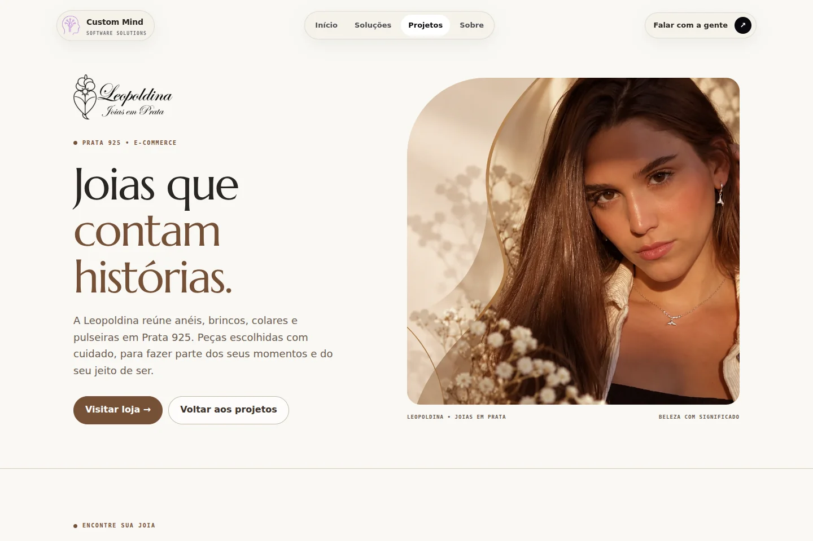

# Case Joias Leopoldina

Página: `/clientes/joias-leopoldina.html`  
Branch: `feat/cliente-joias-leopoldina`  
Implementação revisada: `4d01150d582ec4b10ae80101f491dc266b220d52`  
Base: `main`, commit `9015c1c6e7f03c8ef5b93efbfc070cc3fffd4e75`.

A Joias Leopoldina passa a ter uma página própria no portfólio, um card na home e um card no diretório de projetos. O objetivo é apresentar a marca e suas peças e conduzir à loja oficial. A abertura, navegação, footer, CSS modular v3 e JavaScript do site continuam sendo a estrutura existente.

## Referências analisadas

Foram navegados a home, o diretório e os cinco cases publicados da Custom Mind. Cada case combina o header/footer institucional com cores, fotografias e composição do cliente: Avelar em amarelo/azul, LB Fit em rosa, Patrícia em vinho/marfim, Lara em rosa/lilás e Caligulas em preto/dourado. A home usa o deck por roda do mouse e teclado no desktop e carrossel horizontal no celular. O diretório é um grid de páginas independentes.

Na Leopoldina foram analisados a home, o catálogo, categorias, filtro por preço, ordenação, paginação e uma ficha de produto com imagens, descrição, quantidade e cálculo de frete. A loja usa marfim, areia, títulos Marcellus, corpo Inter, fotografias quentes, categorias por tipo de peça e uma seção com a história do Coração de Viana. O próprio footer identifica a Custom Mind como desenvolvedora. Preços e estoque ficam na loja oficial.

## Direção visual e conteúdo

O tema usa marfim `#faf8f4`, areia `#eae0d3`, texto `#292522` e bronze `#755037`. A fonte Marcellus é hospedada localmente, com licença OFL incluída; o corpo mantém a fonte da arquitetura v3. A assinatura é o enquadramento editorial estático da abertura. Os únicos efeitos novos são o feedback dos links e um zoom discreto nas categorias, desativados em reduced motion.

Sequência: apresentação e visita à loja; seleção de anéis, brincos, colares e pulseiras; links para chokers, pingentes e conjuntos; história da marca; detalhe de uma peça; acesso final à loja. O texto se baseia na comunicação publicada pela Leopoldina. Não foram acrescentadas métricas, depoimentos, promessas de desempenho ou resultados comerciais.

Os estilos estão em `assets/css/client-leopoldina-v1.css` e atingem apenas `.theme-leopoldina-page`, `.case-f` e `.theme-leopoldina`. O bundle v3, os outros temas e o JavaScript compartilhado não foram alterados. A home passa a escrever o card Caligulas no HTML, com o mesmo conteúdo antes inserido pelo JS, para preservar a ordem dos seis projetos e o contador. O fallback existente reconhece esse card e não o duplica.

## Imagens

As 11 imagens adicionadas usam WebP e somam 781.922 bytes. As proporções foram preservadas na conversão, com dimensões ajustadas ao uso. Logo e símbolo mantêm transparência; as fotografias têm largura/altura explícitas no HTML. O hero usa imagens diferentes para desktop/celular. As demais imagens usam lazy loading. A arte de compartilhamento tem 1200 × 630 px.

Originais relativos à pasta `joiasleopoldina/` do ZIP fornecido:

| Uso | Arquivo original | WebP |
|---|---|---|
| Abertura desktop e cards | `banners/banner1.png` | `hero-desktop.webp` |
| Abertura celular | `banners/banner1mobile.png` | `hero-mobile.webp` |
| Anéis | `lote1/lote 1/produto1_lifestyle.png` | `anel-ametista.webp` |
| Brincos | `lote3/lote3/produto15_lifestyle.png` | `brincos-coracao.webp` |
| Colares | `lote3/lote3/produto13_lifestyle.png` | `colar-larimar.webp` |
| Pulseiras | `lote5/lote5/produto23_lifestyle2.png` | `pulseira-paraiba.webp` |
| História | `imagens-enviadas/129d8f15-7bc2-4889-a83a-8b2e73cfa76f.png` | `editorial.webp` |
| Detalhe | `lote3/lote3/produto14_macroDetalhe.png` | `detalhe-colar.webp` |
| Logo | `imagens-enviadas/logo 4k.png` | `logo.webp` |
| Símbolo | `imagens-enviadas/favicon.png` | `simbolo.webp` |
| Compartilhamento | `banners/0a01b45e-c925-465c-940d-a2e825be2305.png` | `social.webp` |

## SEO

Nova URL na fonte `.harness/site/site-content.json`, sitemap e `llms.txt`. A página tem título, description, canonical, Open Graph/Twitter, um H1, texto alternativo e JSON-LD de WebPage/BreadcrumbList. O schema descreve o case editorial e aponta para os canais oficiais da cliente. O GTM e os contatos da Custom Mind foram reaproveitados sem alterações.

## Revisão e verificações

As capturas abaixo correspondem à implementação `4d01150d582ec4b10ae80101f491dc266b220d52`. A página foi renderizada em Chromium; imagens e fonte local carregaram em todas as larguras. A revisão visual cobriu a abertura, a página completa, o card mobile e o card de projetos.

| Rota | Viewport | Evidência | Resultado |
|---|---|---|---|
| `/clientes/joias-leopoldina.html` | 1440 × 960 | [Abertura](desktop.webp), [página completa](desktop-completo.webp) | Sem overflow ou imagens quebradas; fonte e CTA corretos |
| `/clientes/joias-leopoldina.html` | 1024 × 960 | [Tablet](tablet.webp) | Composição e enquadramentos revisados |
| `/clientes/joias-leopoldina.html` | 760 × 960 | [Dados da verificação](verificacao.json) | Hero mobile, menu e categorias em duas colunas |
| `/clientes/joias-leopoldina.html` | 390 × 960 | [Mobile](mobile.webp) | Menu abre/fecha; fluxo vertical e fotos revisados |
| `/clientes/joias-leopoldina.html` | 320 × 960 | [Dados da verificação](verificacao.json) | Sem overflow; botões cabem e menu funciona |
| `/index.html` | 1440 × 960 | [Dados da verificação](verificacao.json) | Deck com seis cards; teclado percorre e abre o novo case |
| `/index.html` | 390 × 844 | [Card mobile](card-mobile.webp) | Carrossel, imagem acima do texto e acesso ao case funcionando |
| `/clientes/index.html` | 1440 × 960 | [Card de projetos](card-projetos.webp) | Seis projetos; o novo card abre a página correta |

O link “Voltar aos projetos” também foi testado. O primeiro viewport da home foi comparado com `main`, em 1440 × 960 e reduced motion: **zero pixels diferentes**. As requisições de analytics foram bloqueadas somente no ambiente local de QA.

Verificações do projeto concluídas:

- `node --check assets/js/custommind-site-v3.js`
- `node scripts/sync-site-chrome.mjs --check`
- `node scripts/audit-unused-assets.mjs`
- `node .harness/harness.mjs check`
- `node .harness/sync-seo.mjs --check`
- `git diff --check`

O harness registra zero erros e um aviso preexistente sobre os 22 imports do bundle CSS v3, que não foi modificado. Os originais do ZIP não fazem parte da árvore de produção.

